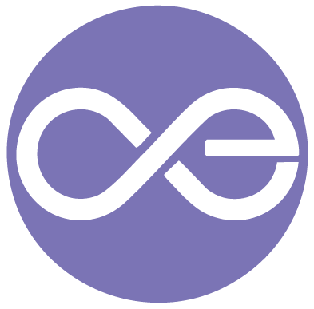
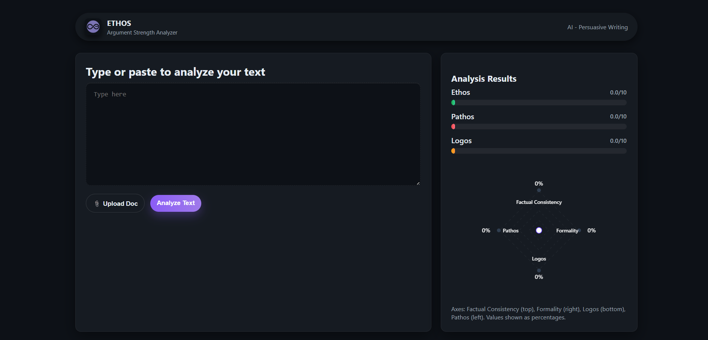

<div align="center">

  

  # 🎙️ Ethos: Automated Rhetorical Analysis Engine
  
  **Quantifying Persuasion using Natural Language Processing & Aristotle’s Rhetoric**

  [](https://www.python.org/)
  [](https://flask.palletsprojects.com/)
  [](https://www.nltk.org/)
  []()

</div>

<br />

## 📖 Overview

**Ethos** is an AI-powered tool designed to deconstruct the "DNA" of a persuasive speech. By applying **Aristotle’s Rhetorical Triangle**—Ethos (Credibility), Pathos (Emotion), and Logos (Logic)—to modern Natural Language Processing (NLP), this tool provides a quantitative breakdown of *why* a speech is convincing.

Simply paste a **YouTube URL**, and the engine fetches the transcript, analyzes the linguistic patterns, and visualizes the rhetorical structure.

---

## 📸 Dashboard Demo

<div align="center">
  
</div>

---

## ⚙️ How It Works

The system splits the analysis into three distinct processing pipelines, effectively digitizing ancient rhetorical theory:

### 🧠 1. Pathos (The Emotional Engine)
* **Goal:** Measure emotional resonance and connection.
* **Algorithm:** * Uses `TextBlob` for sentiment analysis.
  * Calculates **Emotional Intensity** using a custom formula:  
    $$Intensity = Subjectivity \times (1 + |Polarity|)$$
  * Detects high-arousal linguistic patterns that drive audience engagement.

### 🤝 2. Ethos (The Credibility Engine)
* **Goal:** Quantify the speaker's authority and inclusivity.
* **Algorithm:**
  * **Inclusion Ratio:** Analyzes the balance of inclusive pronouns ("We", "Us") vs. exclusive pronouns ("I", "Me") to measure populist appeal.
  * **Authority Auditing:** Scans for markers of expertise (e.g., "Research", "Experience", "Evidence") to score credibility.

### 📐 3. Logos (The Logic Engine)
* **Goal:** Evaluate structural coherence and argumentation.
* **Algorithm:**
  * **Semantic Coherence:** Splits the speech into halves and uses **Cosine Similarity** (via TF-IDF vectorization) to check if the conclusion logically follows the introduction.
  * **Fallacy Detection:** Uses Regex-based pattern matching to flag common logical fallacies (e.g., "Slippery slope", "Ad hominem").

---

## 🛠️ Project Structure

```bash
├── assets/              # Images and Logos for README
├── core.py              # YouTube API Wrapper & Transcript Extraction
├── analyze.py           # Main Orchestrator (Weights: 40% Pathos, 30% Ethos, 30% Logos)
├── pathos.py            # Sentiment & Emotional Intensity Logic
├── ethos.py             # Pronoun & Authority Analysis Logic
├── logos.py             # Coherence & Fallacy Detection Logic
├── final.py             # Flask Backend Controller
├── index.html           # Frontend Dashboard
├── script.js            # Visualization Logic (Chart.js / Vanilla JS)
└── requirements.txt     # Dependencies

🚀 Getting Started
Prerequisites
Python 3.x

A valid YouTube Video URL (with captions enabled)

Installation
1. Clone the repository
git clone [https://github.com/prathamg007/DES646_Project_2025-26-I.git](https://github.com/prathamg007/DES646_Project_2025-26-I.git)
cd DES646_Project_2025-26-I

2. Install Dependencies
pip install requirements.txt

3. Run the Application
python final.py

📊 Sample Analysis
Metric,Score,Insight
Pathos,8.5/10,High emotional intensity; heavy use of subjective adjectives.
Ethos,7.2/10,"Strong ""We"" vs ""I"" ratio; inclusive leadership style."
Logos,6.4/10,"Moderate coherence; detected 1 potential ""Slippery Slope"" fallacy."
Overall,7.4/10,Highly Persuasive

